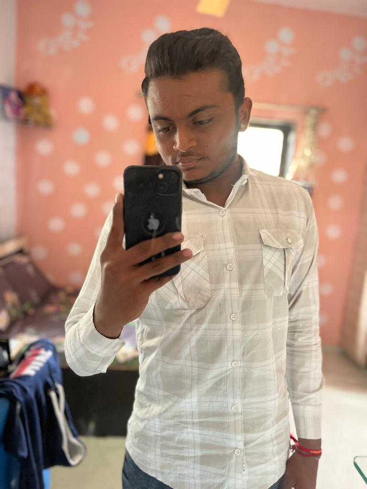
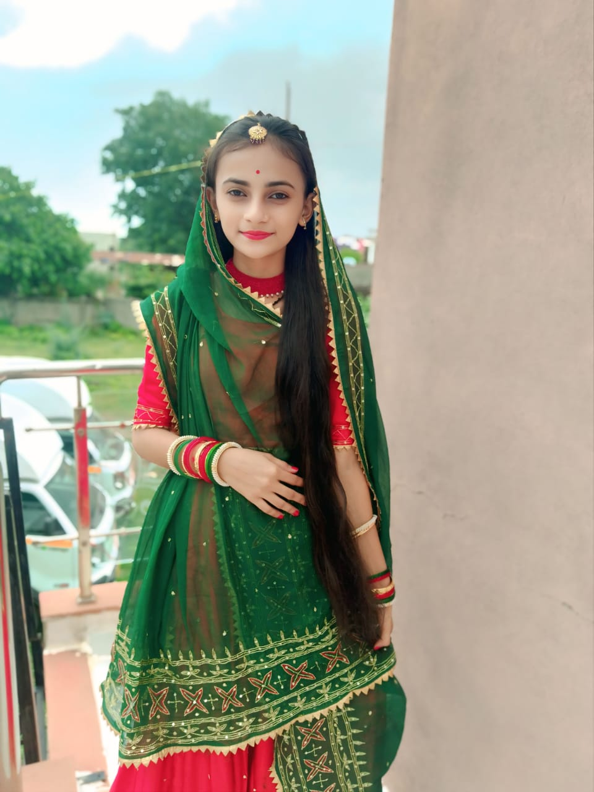

<!DOCTYPE html>
<html lang="en">
<head>
  <meta charset="UTF-8" />
  <meta name="viewport" content="width=device-width, initial-scale=1.0" />
  <title>Nexora - Creative Digital Agency</title>
  <link href="https://cdn.jsdelivr.net/npm/tailwindcss@2.2.19/dist/tailwind.min.css" rel="stylesheet">
  
  

  
</head>
<body>

  <!-- Background -->
  

  <!-- Navbar -->
  <header class="fixed w-full top-0 left-0 z-50 bg-[#0f172ae6] backdrop-blur-md border-b border-gray-800">
    <nav class="max-w-7xl mx-auto flex justify-between items-center px-6 py-4">
      <h1 class="text-2xl font-bold text-indigo-400">Nexora</h1>
      

        <a href="#home" class="hover:text-indigo-400">Home</a>
        <a href="#about" class="hover:text-indigo-400">About</a>
        <a href="#services" class="hover:text-indigo-400">Services</a>
        <a href="#team" class="hover:text-indigo-400">Team</a>
        <a href="#inspiration" class="hover:text-indigo-400">Inspiration</a>
        <a href="#contact" class="hover:text-indigo-400">Contact</a>
      

    </nav>
  </header>

  <!-- Hero -->
  <section id="home" class="h-screen flex flex-col items-center justify-center text-center px-6">
    <h2 class="text-4xl md:text-6xl font-extrabold mb-4 text-indigo-300">We’re Nexora</h2>
    
A fresh and ambitious digital agency built by young creators. Though new, we’re driven by creativity, innovation, and a desire to help small brands grow online.

    <a href="#contact" class="bg-indigo-600 hover:bg-indigo-700 px-8 py-3 rounded-full text-white font-semibold transition">Let’s Build Together</a>
  </section>

  <!-- About -->
  <section id="about" class="max-w-5xl mx-auto px-6 py-20 text-center">
    <h3 class="text-3xl font-bold text-indigo-400 mb-6">About Us</h3>
    

      Nexora is a newly established creative digital agency based in India. We may be new to the industry, but we’re fueled by passion and innovation.  
      Our mission is to help startups and small businesses build strong digital foundations — through beautiful design, smart technology, and honest collaboration.  
      We believe every brand, no matter how small, deserves a digital presence that stands out.
    

  </section>

  <!-- Services -->
  <section id="services" class="max-w-6xl mx-auto px-6 py-20 text-center">
    <h3 class="text-3xl font-bold text-indigo-400 mb-12">What We Offer</h3>
    

      

        <h4 class="text-xl font-semibold text-indigo-300 mb-3">Web Development</h4>
        
We build modern, responsive websites that help you launch your online identity quickly and affordably.

      

      

        <h4 class="text-xl font-semibold text-indigo-300 mb-3">Brand Design</h4>
        
From logos to color palettes — we help you create a consistent and professional visual identity.

      

      

        <h4 class="text-xl font-semibold text-indigo-300 mb-3">Digital Strategy</h4>
        
We help small brands find their voice and reach the right audience through smart, creative digital strategies.

      

    

  </section>

  <!-- Team -->
  <section id="team" class="max-w-6xl mx-auto px-6 py-20 text-center">
    <h3 class="text-3xl font-bold text-indigo-400 mb-10">Meet the Founders</h3>
    

      

        
        <h4 class="text-xl font-bold text-indigo-300">yashpalsinh jadeja</h4>
        
Founder & Developer

        
A passionate developer with a vision to help small businesses grow through technology and design.

      

      

        
        <h4 class="text-xl font-bold text-indigo-300">Vaishaliba Jadeja</h4>
        
Co-Founder & Designer

        
Creative mind behind Nexora’s visual storytelling, focused on design that inspires and engages.

      

    

  </section>

  <!-- Inspiration Section -->
  <section id="inspiration" class="max-w-4xl mx-auto px-6 py-20 text-center">
    <h3 class="text-3xl font-bold text-indigo-400 mb-6">Our Inspiration</h3>
    

      
      <h4 class="text-2xl font-semibold text-indigo-300">Rajendrasinh Jadeja</h4>
      
The guiding light behind Nexora

      

        Behind every dream is someone who inspires it.  
        Maheshbhai Parmar — a man of integrity, hard work, and vision — is the heart and inspiration of Nexora.  
        His values of honesty, dedication, and perseverance guide our journey every single day.  
        This agency stands as a tribute to his encouragement and belief in creating something meaningful.
      

    

  </section>

  <!-- Contact -->
  <section id="contact" class="max-w-3xl mx-auto px-6 py-20 text-center">
    <h3 class="text-3xl font-bold text-indigo-400 mb-8">Let’s Talk</h3>
    
We’re always excited to collaborate with growing startups and small businesses. Let’s turn your idea into something amazing — together.

    <form class="space-y-4">
      <input type="text" placeholder="Your Name" class="w-full p-3 rounded-lg bg-gray-800 border border-gray-700 focus:ring-2 focus:ring-indigo-500 focus:outline-none">
      <input type="email" placeholder="Your Email" class="w-full p-3 rounded-lg bg-gray-800 border border-gray-700 focus:ring-2 focus:ring-indigo-500 focus:outline-none">
      <textarea placeholder="Your Message" rows="4" class="w-full p-3 rounded-lg bg-gray-800 border border-gray-700 focus:ring-2 focus:ring-indigo-500 focus:outline-none"></textarea>
      <button class="w-full py-3 bg-indigo-600 hover:bg-indigo-700 rounded-lg font-semibold">Send Message</button>
    </form>
  </section>

  <!-- Footer -->
<footer class="bg-[#0f172a] border-t border-gray-800 text-gray-400">
  

    
    <!-- About -->
    

      <h4 class="text-indigo-400 font-bold text-lg">Nexora</h4>
      
A creative digital agency helping startups and small businesses grow online with innovative design and smart digital strategies.

      
© 2025 Nexora Agency. All rights reserved.

    

    <!-- Quick Links -->
    

      <h4 class="text-indigo-400 font-bold text-lg mb-4">Quick Links</h4>
      <ul class="space-y-2 text-sm">
        <li><a href="#home" class="hover:text-indigo-300 transition">Home</a></li>
        <li><a href="#about" class="hover:text-indigo-300 transition">About</a></li>
        <li><a href="#services" class="hover:text-indigo-300 transition">Services</a></li>
        <li><a href="#team" class="hover:text-indigo-300 transition">Team</a></li>
        <li><a href="#contact" class="hover:text-indigo-300 transition">Contact</a></li>
      </ul>
    

    <!-- Contact & Social -->
    

      <h4 class="text-indigo-400 font-bold text-lg mb-2">Contact</h4>
      
Email: <a href="mailto:hello@nexora.com" class="hover:text-indigo-300">hello@nexora.com</a>

      
Phone: <a href="tel:+911234567890" class="hover:text-indigo-300">+91 12345 67890</a>

      

        <a href="#" class="text-gray-400 hover:text-indigo-300 transition">
          <svg class="w-5 h-5" fill="currentColor" viewBox="0 0 24 24"><path d="M22,12c0-5.52-4.48-10-10-10S2,6.48,2,12c0,4.99,3.66,9.12,8.44,9.88v-6.99H7.9v-2.89h2.54V9.84c0-2.51,1.49-3.89,3.77-3.89,1.09,0,2.23,0.19,2.23,0.19v2.46h-1.26c-1.24,0-1.63,0.77-1.63,1.56v1.88h2.78l-0.44,2.89h-2.34v6.99C18.34,21.12,22,16.99,22,12z"/></svg>
        </a>
        <a href="#" class="text-gray-400 hover:text-indigo-300 transition">
          <svg class="w-5 h-5" fill="currentColor" viewBox="0 0 24 24"><path d="M22.23 5.924c-.793.352-1.645.59-2.538.696a4.48 4.48 0 001.962-2.473c-.856.507-1.806.875-2.814 1.073a4.481 4.481 0 00-7.63 4.088A12.717 12.717 0 013 4.787a4.48 4.48 0 001.387 5.981c-.705-.022-1.369-.216-1.949-.538v.054a4.48 4.48 0 003.593 4.392 4.498 4.498 0 01-2.018.077 4.481 4.481 0 004.182 3.112 8.99 8.99 0 01-5.563 1.917c-.362 0-.721-.021-1.077-.063a12.7 12.7 0 006.884 2.015c8.261 0 12.778-6.848 12.778-12.778 0-.195-.005-.389-.014-.582a9.126 9.126 0 002.24-2.323z"/></svg>
        </a>
        <a href="#" class="text-gray-400 hover:text-indigo-300 transition">
          <svg class="w-5 h-5" fill="currentColor" viewBox="0 0 24 24"><path d="M12 2.163c3.204 0 3.584.012 4.85.07 1.17.054 1.987.24 2.452.403a4.92 4.92 0 011.675 1.03 4.919 4.919 0 011.03 1.675c.164.465.35 1.282.403 2.452.058 1.266.07 1.645.07 4.849s-.012 3.584-.07 4.85c-.054 1.17-.24 1.987-.403 2.452a4.923 4.923 0 01-1.03 1.675 4.923 4.923 0 01-1.675 1.03c-.465.164-1.282.35-2.452.403-1.266.058-1.645.07-4.849.07s-3.584-.012-4.85-.07c-1.17-.054-1.987-.24-2.452-.403a4.923 4.923 0 01-1.675-1.03 4.923 4.923 0 01-1.03-1.675c-.164-.465-.35-1.282-.403-2.452C2.175 15.747 2.163 15.368 2.163 12s.012-3.584.07-4.85c.054-1.17.24-1.987.403-2.452a4.92 4.92 0 011.03-1.675 4.92 4.92 0 011.675-1.03c.465-.164 1.282-.35 2.452-.403C8.416 2.175 8.796 2.163 12 2.163zm0 1.838c-3.168 0-3.548.012-4.797.069-1.035.045-1.597.21-1.965.35a3.092 3.092 0 00-1.127.735 3.092 3.092 0 00-.735 1.127c-.14.368-.305.93-.35 1.965-.057 1.249-.069 1.63-.069 4.797s.012 3.548.069 4.797c.045 1.035.21 1.597.35 1.965.163.42.383.794.735 1.127.334.334.707.572 1.127.735.368.14.93.305 1.965.35 1.249.057 1.63.069 4.797.069s3.548-.012 4.797-.069c1.035-.045 1.597-.21 1.965-.35a3.092 3.092 0 001.127-.735 3.092 3.092 0 00.735-1.127c.14-.368.305-.93.35-1.965.057-1.249.069-1.63.069-4.797s-.012-3.548-.069-4.797c-.045-1.035-.21-1.597-.35-1.965a3.092 3.092 0 00-.735-1.127 3.092 3.092 0 00-1.127-.735c-.368-.14-.93-.305-1.965-.35-1.249-.057-1.63-.069-4.797-.069zm0 4.838a5 5 0 110 10 5 5 0 010-10zm0 1.838a3.162 3.162 0 100 6.324 3.162 3.162 0 000-6.324zm6.406-2.375a1.162 1.162 0 11-2.324 0 1.162 1.162 0 012.324 0z"/></svg>
        </a>
      

    

    
  

</footer>

  
</body>
</html>
